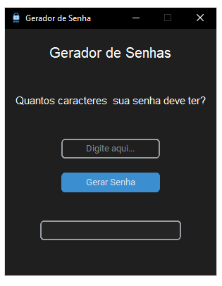

<h1 align="center">Olá, meu nome é Samuel Souza👋</h1>
  
  

  <h3 align="center">Gerador de senhas Python</h3>

<h1 align="center">Sobre o Projeto </h1>

Este projeto consiste em uma versão executável do seguinte projeto web: github.com/devsamuca/Password-Generator

<h1 align="center"> Construído com: </h1>

As seguintes ferramentas e tecnologias foram utilizadas para executar este projeto:

 

  
  
  

<h1 align="center"> Interface do Software</h1>

  

<h1 align="center"> Contato </h1>

 

Link do Projeto: [https://github.com/devsamuca/Python-Password-Generator.git](https://github.com/devsamuca/Gera-Senha-Python.git)

